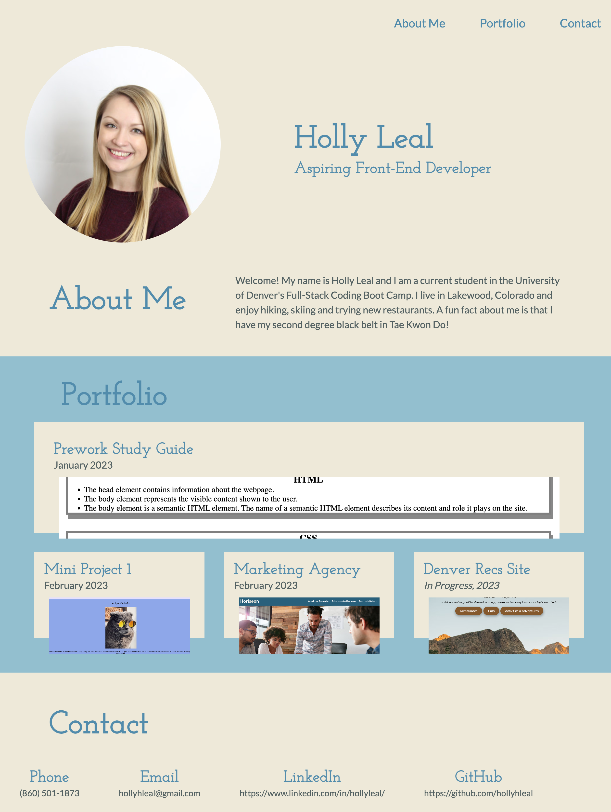

# portfolio

In this project, I created a web page with HTML and custom CSS to feature my portfolio. I completed the following:

1. Developed a custom webpage including my name, photo, and links to: About Me, Portfolio and Contact.
2. Added anchor tags to the navigation items that bring the user to each corresponding section on click.
3. Included a Portfolio section containing links to my most recent projects. These all contain screenshots and link to the deployed applications in a new tab.
4. In the Portfolio section, the first project is larger in size than the others. I accomplished this with flexbox and flex properties.
5. Included a media query to create responsive content that adapts to the user's viewport.

## Link:

[https://hollyhleal.github.io/portfolio/](https://hollyhleal.github.io/portfolio/)

## Screenshot:

